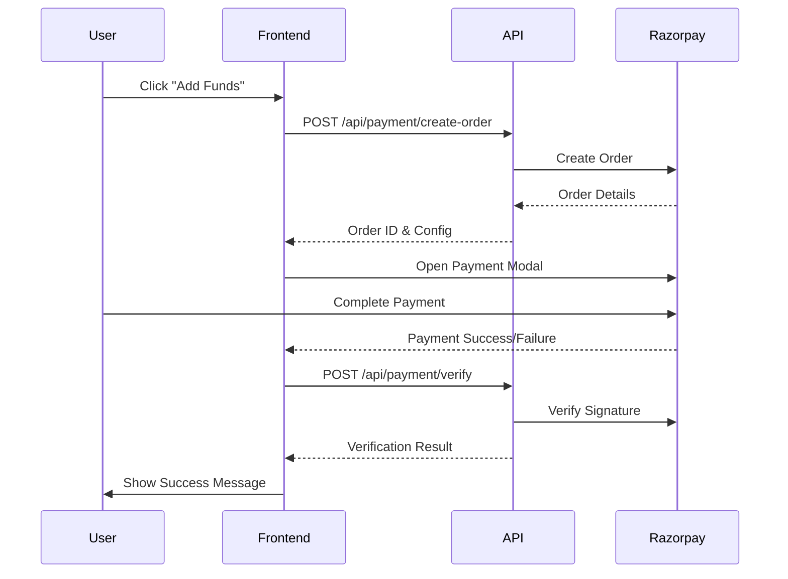

# Payment API Integration Guide

> **Routes API - Wallet Top-up with Razorpay**  
> Version: 1.0.0  
> Last Updated: January 19, 2026

---

## Overview

The Routes Payment API enables users to add funds to their wallet using Razorpay integration. This guide covers the complete payment flow from order creation to verification.

### Base URLs

- **Staging**: `https://rn.buildquick.tech`

### Authentication

All payment endpoints require JWT authentication. Include the token in the request header:

```http
Authorization: Bearer YOUR_JWT_TOKEN
```

Or use the custom header:

```http
token: YOUR_JWT_TOKEN
```

---

## Payment Flow



---

## API Endpoints

### 1. Get Razorpay Configuration

Retrieve Razorpay configuration needed for frontend integration.

**Endpoint**: `GET /api/payment/config`

**Authentication**: Not required

**Response**:

```json
{
  "responseCode": 200,
  "responseMessage": "Payment configuration fetched successfully",
  "responseData": {
    "success": true,
    "config": {
      "key": "rzp_live_xxxxxxxxxxxx",
      "currency": "INR",
      "name": "Routes App",
      "description": "Payment for trip booking",
      "image": "https://your-app-logo-url.com/logo.png",
      "theme": {
        "color": "#4CAF50"
      }
    }
  }
}
```

---

### 2. Create Payment Order

Create a Razorpay order for wallet top-up.

**Endpoint**: `POST /api/payment/create-order`

**Authentication**: Required

**Request Body**:

```json
{
  "amount": 500,
  "description": "Adding funds to wallet for ride booking",
  "notes": {
    "source": "mobile_app",
    "promo_code": "FIRST100"
  }
}
```

**Parameters**:

| Field | Type | Required | Description |
|-------|------|----------|-------------|
| `amount` | number | Yes | Amount to add to wallet in rupees (minimum: 1) |
| `description` | string | No | Description of the wallet top-up |
| `notes` | object | No | Additional metadata for the payment |

**Response**:

```json
{
  "responseCode": 200,
  "responseMessage": "Payment order created successfully",
  "responseData": {
    "success": true,
    "order": {
      "id": "order_ABC123XYZ",
      "entity": "order",
      "amount": 50000,
      "amount_paid": 0,
      "amount_due": 50000,
      "currency": "INR",
      "receipt": "receipt_ABC123",
      "status": "created",
      "attempts": 0,
      "notes": {
        "source": "mobile_app",
        "promo_code": "FIRST100"
      },
      "created_at": 1705656000
    },
    "key": "rzp_live_xxxxxxxxxxxx",
    "amount": 50000,
    "currency": "INR",
    "name": "Routes App",
    "description": "Adding funds to wallet for ride booking",
    "prefill": {
      "name": "John Doe",
      "email": "john@example.com",
      "contact": "+919876543210"
    },
    "theme": {
      "color": "#4CAF50"
    }
  }
}
```

**Error Responses**:

```json
{
  "responseCode": 400,
  "responseMessage": "Failed to create payment order",
  "responseData": {
    "success": false,
    "error": "Invalid amount"
  }
}
```

---

### 3. Verify Payment

Verify payment signature and update wallet balance.

**Endpoint**: `POST /api/payment/verify`

**Authentication**: Required

**Request Body**:

```json
{
  "razorpay_order_id": "order_ABC123XYZ",
  "razorpay_payment_id": "pay_XYZ789ABC",
  "razorpay_signature": "5f9c8f8b7a1d2c3e4f5a6b7c8d9e0f1a2b3c4d5e6f7a8b9c0d1e2f3a4b5c6d7"
}
```

**Parameters**:

| Field | Type | Required | Description |
|-------|------|----------|-------------|
| `razorpay_order_id` | string | Yes | Order ID from create-order response |
| `razorpay_payment_id` | string | Yes | Payment ID from Razorpay callback |
| `razorpay_signature` | string | Yes | Signature from Razorpay for verification |

**Response**:

```json
{
  "responseCode": 200,
  "responseMessage": "Payment verified successfully",
  "responseData": {
    "success": true,
    "message": "Payment verified and wallet updated",
    "payment": {
      "id": "60d5ecb74d2c4a1234567891",
      "razorpay_order_id": "order_ABC123XYZ",
      "razorpay_payment_id": "pay_XYZ789ABC",
      "amount": 500,
      "currency": "INR",
      "status": "paid",
      "method": "card",
      "wallet_updated": true,
      "new_wallet_balance": 1500.00
    }
  }
}
```

**Error Responses**:

```json
{
  "responseCode": 400,
  "responseMessage": "Payment verification failed",
  "responseData": {
    "success": false,
    "error": "Invalid signature"
  }
}
```

---

### 4. Handle Payment Failure

Record payment failure details for tracking and analysis.

**Endpoint**: `POST /api/payment/failure`

**Authentication**: Required

**Request Body**:

```json
{
  "razorpay_order_id": "order_ABC123XYZ",
  "error": {
    "code": "PAYMENT_FAILED",
    "description": "Payment was declined by the bank",
    "source": "bank",
    "reason": "insufficient_funds"
  }
}
```

**Parameters**:

| Field | Type | Required | Description |
|-------|------|----------|-------------|
| `razorpay_order_id` | string | Yes | Order ID where payment failed |
| `error.code` | string | Yes | Error code from payment gateway |
| `error.description` | string | Yes | Human-readable error description |
| `error.source` | string | No | Source of the error (bank, gateway, etc.) |
| `error.reason` | string | No | Specific reason for failure |

**Response**:

```json
{
  "responseCode": 200,
  "responseMessage": "Payment failure handled successfully",
  "responseData": {
    "success": true,
    "message": "Payment failure recorded",
    "payment_id": "60d5ecb74d2c4a1234567891",
    "status": "failed",
    "error": {
      "code": "PAYMENT_FAILED",
      "description": "Payment was declined by the bank"
    }
  }
}
```

---

## Integration Examples

### JavaScript / React

```javascript
import axios from 'axios';

const API_BASE_URL = 'https://rn.upraiss.com';
const AUTH_TOKEN = 'your-jwt-token';

// 1. Get Razorpay Config
async function getRazorpayConfig() {
  try {
    const response = await axios.get(`${API_BASE_URL}/api/payment/config`);
    return response.data.responseData.config;
  } catch (error) {
    console.error('Failed to get config:', error);
    throw error;
  }
}

// 2. Create Payment Order
async function createPaymentOrder(amount, description = 'Wallet top-up') {
  try {
    const response = await axios.post(
      `${API_BASE_URL}/api/payment/create-order`,
      { amount, description },
      {
        headers: {
          'token': AUTH_TOKEN,
          'Content-Type': 'application/json'
        }
      }
    );
    return response.data.responseData;
  } catch (error) {
    console.error('Failed to create order:', error);
    throw error;
  }
}

// 3. Open Razorpay Checkout
async function initiatePayment(amount) {
  try {
    // Create order
    const orderData = await createPaymentOrder(amount);
    
    // Razorpay options
    const options = {
      key: orderData.key,
      amount: orderData.amount,
      currency: orderData.currency,
      name: orderData.name,
      description: orderData.description,
      order_id: orderData.order.id,
      prefill: orderData.prefill,
      theme: orderData.theme,
      handler: async function (response) {
        // Payment success - verify
        await verifyPayment(response);
      },
      modal: {
        ondismiss: function() {
          console.log('Payment cancelled');
        }
      }
    };

    const razorpay = new window.Razorpay(options);
    razorpay.open();
    
    razorpay.on('payment.failed', async function (response) {
      // Handle failure
      await handlePaymentFailure(orderData.order.id, response.error);
    });
    
  } catch (error) {
    console.error('Payment initiation failed:', error);
  }
}

// 4. Verify Payment
async function verifyPayment(razorpayResponse) {
  try {
    const response = await axios.post(
      `${API_BASE_URL}/api/payment/verify`,
      {
        razorpay_order_id: razorpayResponse.razorpay_order_id,
        razorpay_payment_id: razorpayResponse.razorpay_payment_id,
        razorpay_signature: razorpayResponse.razorpay_signature
      },
      {
        headers: {
          'token': AUTH_TOKEN,
          'Content-Type': 'application/json'
        }
      }
    );
    
    if (response.data.responseData.success) {
      alert(`Payment successful! New balance: ₹${response.data.responseData.payment.new_wallet_balance}`);
    }
    
    return response.data;
  } catch (error) {
    console.error('Payment verification failed:', error);
    throw error;
  }
}

// 5. Handle Payment Failure
async function handlePaymentFailure(orderId, error) {
  try {
    await axios.post(
      `${API_BASE_URL}/api/payment/failure`,
      {
        razorpay_order_id: orderId,
        error: {
          code: error.code,
          description: error.description,
          source: error.source,
          reason: error.reason
        }
      },
      {
        headers: {
          'token': AUTH_TOKEN,
          'Content-Type': 'application/json'
        }
      }
    );
    
    alert(`Payment failed: ${error.description}`);
  } catch (err) {
    console.error('Failed to record payment failure:', err);
  }
}

// Usage
initiatePayment(500); // Top-up ₹500
```

### React Component Example

```jsx
import React, { useState, useEffect } from 'react';
import axios from 'axios';

const WalletTopup = ({ authToken }) => {
  const [amount, setAmount] = useState(500);
  const [loading, setLoading] = useState(false);
  const [config, setConfig] = useState(null);

  useEffect(() => {
    // Load Razorpay script
    const script = document.createElement('script');
    script.src = 'https://checkout.razorpay.com/v1/checkout.js';
    script.async = true;
    document.body.appendChild(script);

    // Get config
    axios.get('https://rn.upraiss.com/api/payment/config')
      .then(res => setConfig(res.data.responseData.config));

    return () => document.body.removeChild(script);
  }, []);

  const handleTopup = async () => {
    setLoading(true);
    
    try {
      // Create order
      const { data } = await axios.post(
        'https://rn.upraiss.com/api/payment/create-order',
        { amount, description: 'Wallet top-up' },
        { headers: { token: authToken } }
      );

      const orderData = data.responseData;

      // Open Razorpay
      const options = {
        key: orderData.key,
        amount: orderData.amount,
        currency: orderData.currency,
        name: orderData.name,
        description: orderData.description,
        order_id: orderData.order.id,
        prefill: orderData.prefill,
        theme: orderData.theme,
        handler: async (response) => {
          // Verify payment
          const verifyRes = await axios.post(
            'https://rn.upraiss.com/api/payment/verify',
            response,
            { headers: { token: authToken } }
          );
          
          if (verifyRes.data.responseData.success) {
            alert(`Success! New balance: ₹${verifyRes.data.responseData.payment.new_wallet_balance}`);
          }
        },
        modal: {
          ondismiss: () => setLoading(false)
        }
      };

      const razorpay = new window.Razorpay(options);
      razorpay.open();

      razorpay.on('payment.failed', async (response) => {
        await axios.post(
          'https://rn.upraiss.com/api/payment/failure',
          {
            razorpay_order_id: orderData.order.id,
            error: response.error
          },
          { headers: { token: authToken } }
        );
        alert(`Payment failed: ${response.error.description}`);
        setLoading(false);
      });

    } catch (error) {
      console.error('Error:', error);
      alert('Failed to initiate payment');
      setLoading(false);
    }
  };

  return (
    <div className="wallet-topup">
      <h2>Add Funds to Wallet</h2>
      <input
        type="number"
        value={amount}
        onChange={(e) => setAmount(Number(e.target.value))}
        min="1"
        placeholder="Enter amount"
      />
      <button onClick={handleTopup} disabled={loading || !config}>
        {loading ? 'Processing...' : `Add ₹${amount}`}
      </button>
    </div>
  );
};

export default WalletTopup;
```

### cURL Examples

```bash
# 1. Get Config
curl -X GET https://rn.upraiss.com/api/payment/config

# 2. Create Order
curl -X POST https://rn.upraiss.com/api/payment/create-order \
  -H "token: YOUR_JWT_TOKEN" \
  -H "Content-Type: application/json" \
  -d '{
    "amount": 500,
    "description": "Wallet top-up"
  }'

# 3. Verify Payment
curl -X POST https://rn.upraiss.com/api/payment/verify \
  -H "token: YOUR_JWT_TOKEN" \
  -H "Content-Type: application/json" \
  -d '{
    "razorpay_order_id": "order_ABC123XYZ",
    "razorpay_payment_id": "pay_XYZ789ABC",
    "razorpay_signature": "signature_here"
  }'

# 4. Report Failure
curl -X POST https://rn.upraiss.com/api/payment/failure \
  -H "token: YOUR_JWT_TOKEN" \
  -H "Content-Type: application/json" \
  -d '{
    "razorpay_order_id": "order_ABC123XYZ",
    "error": {
      "code": "PAYMENT_FAILED",
      "description": "Payment declined by bank"
    }
  }'
```

---

## Testing

### Test Cards (Razorpay Test Mode)

| Card Number | CVV | Expiry | Description |
|-------------|-----|--------|-------------|
| 4111 1111 1111 1111 | Any | Any future date | Success |
| 4012 0010 0000 0001 | Any | Any future date | Failure |
| 5555 5555 5555 4444 | Any | Any future date | Success |

### Test UPI

- **Success**: success@razorpay
- **Failure**: failure@razorpay

### Test Amounts

- ₹1 - ₹100: Small transactions
- ₹500 - ₹5000: Regular top-ups
- ₹10000+: Large transactions (may require additional verification)

---

## Error Codes

| Code | Description | Action |
|------|-------------|--------|
| 400 | Bad Request | Check request parameters |
| 401 | Unauthorized | Verify authentication token |
| 404 | Not Found | Check endpoint URL |
| 500 | Server Error | Contact support |

### Common Payment Errors

| Error Code | Description | Solution |
|------------|-------------|----------|
| `PAYMENT_FAILED` | General payment failure | Ask user to retry |
| `INVALID_SIGNATURE` | Signature verification failed | Security issue - log and investigate |
| `PAYMENT_CANCELLED` | User cancelled payment | Show cancellation message |
| `INSUFFICIENT_FUNDS` | Bank declined - insufficient balance | Ask user to check balance |
| `CARD_DECLINED` | Card declined by bank | Try different payment method |

---

## Best Practices

### Security

1. **Never expose Razorpay Key Secret** on the frontend
2. **Always verify payments** on the server side
3. **Use HTTPS** for all API calls
4. **Store tokens securely** (use secure storage, not localStorage)
5. **Implement rate limiting** to prevent abuse

### User Experience

1. **Show loading states** during payment processing
2. **Handle all error cases** gracefully
3. **Provide clear error messages** to users
4. **Confirm successful payments** with visual feedback
5. **Update wallet balance** immediately after verification

### Performance

1. **Cache Razorpay config** to reduce API calls
2. **Lazy load** Razorpay script only when needed
3. **Handle network failures** with retry logic
4. **Show progress indicators** for long operations

---

## Webhooks (Optional)

For server-side payment notifications, configure webhooks in your Razorpay dashboard:

**Webhook URL**: `https://rn.upraiss.com/api/payment/webhook`

**Events to subscribe**:
- `payment.captured`
- `payment.failed`
- `order.paid`

---

## Support

- **API Documentation**: [https://rn.upraiss.com/api-docs](https://rn.upraiss.com/api-docs)
- **Razorpay Docs**: [https://razorpay.com/docs](https://razorpay.com/docs)
- **Support Email**: support@routes.com

---

## Changelog

### Version 1.0.0 (2026-01-19)
- Initial release
- Wallet-based payment system
- Razorpay integration
- Payment verification flow
- Error handling and failure tracking

---

**© 2026 Routes API. All rights reserved.**
